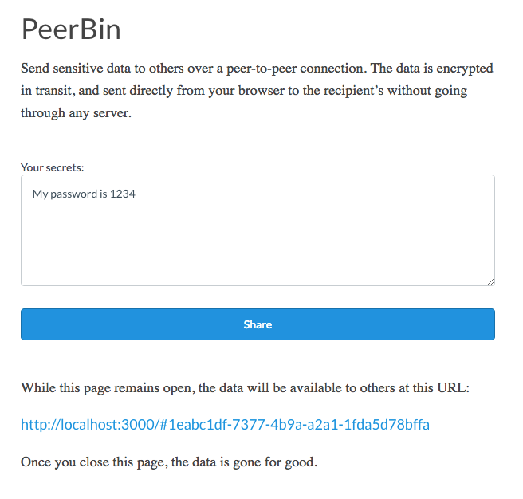

# peerbin



Peerbin is a tiny web app for sharing secrets, such as private keys and
passwords (but it could be anything, of course). Peerbin uses WebRTC to connect
the source and destination browsers directly together over an encrypted
peer-to-peer connection, so that the secret is never seen by the server, not
even in encrypted form.

In order for the browsers to find each other, they'll need to learn each others
public IP addresses. WebRTC uses standard STUN techniques to do this, and
Peerbin runs a small websocket server to facilitate browsers finding and
connecting to each other. Once the browsers have established their P2P
connection, there is no further communication through the server.

Most modern browsers support WebRTC, but one glaring exception is Safari, which
means Peerbin does not work on iOS. Supposedly they are working on it.

## Running

I'm not running a publicly available Peerbin server, at least not at the moment.
To use Peerbin, you'll need to run your own instance of it. It is a tiny node.js
application with some static front-end content.

It is strongly recommended that you serve Peerbin over HTTPS, so that the
websocket communication is encrypted and the connection UUID is not exposed.

### Running in Docker

The easiest way to run Peerbin is to just build and run the provided Dockerfile.

```bash
docker build -t peerbin .
docker run --rm -p 80:8080 peerbin
```

The docker image runs the server on port 80, which you can map to any external
port you want.

### Manual Setup

```bash
npm install
./node_modules/.bin/webpack
node app.js
```

## Rationale

Peerbin was written as a proof-of-concept to learn more about WebRTC. There's an
argument for this being even more secure than projects such as
[ZeroBin](https://zerobin.net), which use client-side encryption so that the
server only ever sees the encrypted data. But, I think in the end, if you can't
trust the server then you really shouldn't be using it to share sensitive
information, even if it claims to never see the data. So I'm not sure there's a
compelling reason to choose Peerbin over ZeroBin, other than perhaps it just
being easier to run and scale, since there is no data store.

## Contributing

1. Create an issue and describe your idea
2. [Fork it] (https://github.com/codekitchen/peerbin/fork)
3. Create your feature branch (`git checkout -b my-new-feature`)
4. Commit your changes (`git commit -am 'Add some feature'`)
5. Publish the branch (`git push origin my-new-feature`)
6. Create a new Pull Request
7. Profit! :white_check_mark:

## License

Peerbin is released under the [MIT License](http://www.opensource.org/licenses/MIT).
